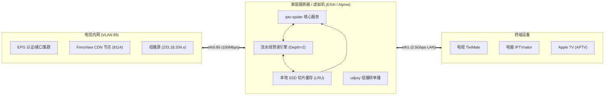

# Shanghai Telecom IPTV Spider & Catchup Accelerator (上海电信 IPTV 爬虫与极速回看代理)

[](https://golang.org)
[](https://alpinelinux.org)
[](LICENSE)
[](README.md)

**上海电信 IPTV 全功能代理与回看加速服务**。完美解决第三方播放器（如 **TiviMate**、**IPTVnator**、**APTV**、**PotPlayer**）在播放上海电信 IPTV 时移/回看节目时出现的 **16 秒卡顿、38 秒断流卡死、RTSP RST 拒绝** 等顽疾。

内置自主逆向研发的 **HLS 流水线超前预读与多路并发 LRU 缓存引擎**，将回看切片响应延时从 40+ 秒压降至 **17 毫秒**，实现全链路秒开、无感拖拽与长效稳定播放。

---

## 🌟 核心特性

- 📡 **全自动 CTC 认证与 EPG 同步**:
  - 自动模拟机顶盒开机握手、CTC 令牌计算与鉴权续期（支持中兴/华为平台）；
  - 定时自动抓取全量频道（含 4K、高清、央视、卫视、上海本地台）及过去 7 天完整节目单。
- 📺 **组播直播秒开 (Multicast Live)**:
  - 配合 `udpxy` 将电信内网 RTP/IGMP 组播流转为局域网 HTTP 单播流，多台设备同时看直播不消耗外部宽带。
- ⚡ **电信 FonsView CDN 流控逆向与回看加速 (Zero-Stutter Catchup)**:
  - **规避 23MB 限速悬崖**: 逆向破解电信 CDN 单长连接超过 23MB 强行限速至 240KB/s 的流控机制；
  - **机顶盒协议模拟**: 强制注入 `Range: bytes=0-` 头与单切片独立短连接，每次下载均激发 CDN **100 Mbps 满速突发**；
  - **流水线超前预读 (Pipeline Preload)**: 播放当前分片时，服务端在后台自动并发预载后续 2 个分片落盘，播放器请求命中率 > 95%，本地响应时间仅 **17 ~ 28 毫秒**；
  - **边下边播零等待**: 采用 `io.MultiWriter` 双写，首个分片无需等待下载完毕即可流式直吐客户端。
- 🔄 **真正 LRU 淘汰与多客户端并发支持**:
  - 每次读取切片自动更新访问时间戳（`os.Chtimes`），支持客厅电视、卧室盒子、手机同时点播不同回看节目；
  - 磁盘缓存严格控制在 **300 MB 以内**（默认保留 30 个切片），可在 512MB 内存的极简虚拟机或软路由上常年无人值守运行。
- 🎯 **标准 M3U 与 XMLTV 输出**:
  - 原生提供 `/api/m3u8`、`/api/epg.xml`、`/api/catchup` 接口，无缝兼容 TiviMate、APTV、IPTVnator 的回看功能。

---

## 🏛️ 系统架构图



---

## 📂 项目结构

```text
.
├── config/                 # 配置定义与映射模型
├── config.example.yaml     # 生产脱敏配置文件模板
├── config.yaml             # 本机实际运行配置文件 (勿提交敏感凭证)
├── docs/                   # 深度实战与逆向文档
│   ├── 01_architecture_and_principle.md # 架构与原理 (认证、EPG、组播、HLS)
│   ├── 02_network_and_esxi_setup.md     # 网络拓扑与 ESXi / Alpine 虚拟机配置
│   ├── 03_stb_packet_capture_guide.md   # 物理机顶盒抓包与参数逆向指南
│   ├── 04_hls_catchup_acceleration.md   # CDN 流控逆向与流水线预读缓存引擎
│   ├── 05_player_setup_tivimate.md      # 播放器配置实战 (TiviMate / IPTVnator)
│   ├── 06_troubleshooting_faq.md        # 疑难排障与常见问题 FAQ
│   ├── 07_rtp2httpd_deployment.md       # rtp2httpd 组播/单播代理部署指南
│   ├── 08_lightweight_python_pcg_iptv.md # 轻量级 Python 抓取方案与 pcg-iptv 参考指南
│   └── 09_configuration_and_environment_variables.md # 配置参数详解、环境变量与隐私安全规范
├── global/                 # 全局变量与数据库句柄
├── initialize/             # 日志、数据库与定时任务初始化
├── logo/                   # 央视、卫视、地方台高清台标库
├── model/                  # GORM 数据表模型
├── modules/                # 业务核心模块 (认证、JS 引擎、EPG 抓取)
├── router/
│   └── api/
│       ├── router.go       # 路由分发与 M3U8 动态重写
│       └── segment_cache.go# 高性能切片预读、流式缓存与 LRU 调度引擎
├── scripts/                # 部署脚本 (OpenRC / systemd / 网络路由)
│   ├── iptv-spider.initd   # Alpine Linux 服务自启脚本
│   ├── iptv-spider.service # systemd 服务配置脚本
│   ├── setup_network.sh    # 电信专网策略路由配置脚本
│   └── rtp2httpd/          # rtp2httpd 组播代理一键安装与配置文件
│       ├── install_rtp2httpd.sh # 一键安装与环境初始化脚本
│       ├── rtp2httpd.conf  # 组播绑定与内核缓冲区优化配置
│       ├── rtp2httpd.initd # OpenRC 守护服务脚本
│       └── rtp2httpd.service # systemd 守护服务脚本
├── tools/                  # 调试与性能测试工具箱
│   ├── pcap_analyzer.py    # 机顶盒抓包解析与分片吞吐量统计工具
│   ├── test_stream.py      # 回看流延迟、吞吐量与缓存命中率自动化测试脚本
│   └── pcg-iptv/           # 基于 pcg-iptv 的单文件轻量 Python 抓取脚本 (适合 OpenWrt)
│       └── shctiptv.py
├── go.mod
├── main.go
└── README.md
```

---

## 🚀 快速上手

### 1. 提取物理机顶盒参数
使用抓包工具获取物理机顶盒的关键信息（详细步骤参见 [docs/03_stb_packet_capture_guide.md](docs/03_stb_packet_capture_guide.md)）：
- `mac`: 机顶盒 MAC 地址（如 `18:5e:0b:xx:xx:xx`）
- `sn`: 序列号（如 `00030032540702305260xxxx`）
- `uid`: 业务账号（如 `4833xxxx@etv4`）
- `ip`: IPoE 获取的内网 IP（如 `30.120.xx.xx`）

> [!CAUTION]
> **关键提示**: 抓包完成后，**必须彻底关闭物理机顶盒电源**！否则交换机会出现 MAC 地址漂移，导致下行流全部发往机顶盒，虚拟机瞬间断流！

### 2. 配置与编译

本项目已实现**配置与隐私凭证完全解耦**。所有机顶盒敏感参数（MAC、SN、UID、IP）均通过环境变量管理，`.env` 文件已被 `.gitignore` 排除，保证不会泄露到 GitHub：

```bash
# 1. 克隆项目
git clone https://github.com/your-username/sh-tel-iptv-spider.git
cd sh-tel-iptv-spider

# 2. 从模板创建环境变量文件并填写私密参数 (推荐)
cp .env.example .env
vim .env

# (或者也可以从 config.example.yaml 创建 config.yaml)
# cp config.example.yaml config.yaml

# 3. 编译二进制程序
go build -o iptv-spider main.go
```

### 3. 配置网络路由与启动服务

确保虚拟机已接入电信 IPTV 网络（VLAN 85，参见 [docs/02_network_and_esxi_setup.md](docs/02_network_and_esxi_setup.md)），然后执行：

```bash
# 配置专网静态路由
chmod +x scripts/setup_network.sh
sudo ./scripts/setup_network.sh 30.120.0.1 eth0.85

# 启动服务
./iptv-spider
```

---

## 📊 性能验证与测试工具

本项目自带了自动化性能压测工具，可以在任意机器上验证代理服务的表现：

```bash
# 测试 CCTV-5+ HD 回看流分片下载与缓存命中
python tools/test_stream.py --host 172.16.0.5:8888 --id 123
```

**实测输出效果**:
```text
======================================================================
 Testing Catchup Stream on: 172.16.0.5:8888
 Channel ID : 123
 Playseek   : 20260925170600-20260925183600
======================================================================

[1] Fetching M3U8 Playlist ...
    [OK] Playlist fetched in 0.175s, Total Segments: 360

[2] Testing Sequential Segment Download & Cache Pipeline:
    Seg #    Size (MB)    Latency      Throughput       Source
    -------- ------------ ------------ ---------------- ------------
    #1        10.77 MB      1.225s       73.74 Mbps    [MISS] CDN Origin
    #2        10.93 MB      0.063s     1462.63 Mbps    [HIT] Local Cache
    #3        10.01 MB      0.059s     1432.90 Mbps    [HIT] Local Cache
    #4        10.31 MB      0.041s     2090.18 Mbps    [HIT] Local Cache
    #5         9.56 MB      0.038s     2215.42 Mbps    [HIT] Local Cache

======================================================================
 Test finished. Segments #2-#5 show '[HIT] Local Cache', pipeline working perfectly!
======================================================================
```

---

## 📺 客户端使用指南

在播放器中配置以下地址即可使用（详细图文配置参见 [docs/05_player_setup_tivimate.md](docs/05_player_setup_tivimate.md)）：

| 资源项 | URL 地址示例 | 说明 |
| :--- | :--- | :--- |
| **M3U 播放列表** | `http://172.16.0.5:8888/api/m3u8` | 自动包含全量电视频道与回看捕获参数 |
| **XMLTV 节目单** | `http://172.16.0.5:8888/api/epg.xml` | 过去 7 天与未来 3 天完整 EPG |
| **回看请求入口** | `http://172.16.0.5:8888/api/catchup` | 播放器回看时自动调用 |

- **TiviMate (Android TV)**: 添加 M3U 和 EPG，回看类型选 **附加 (Append)**，回看天数设为 `7`。
- **IPTVnator (PC / Mac)**: 添加 M3U 和 EPG 链接，进入节目单点击播放图标即可秒开。
- **APTV (Apple TV)**: 填入 M3U 订阅，自动识别 `catchup="append"`。

---

## 📖 深度参考文档

- [01. 架构设计与底层原理](docs/01_architecture_and_principle.md)
- [02. 网络拓扑与 ESXi / Alpine 虚拟机配置](docs/02_network_and_esxi_setup.md)
- [03. 真实机顶盒抓包与参数逆向指南](docs/03_stb_packet_capture_guide.md)
- [04. HLS 回看流控逆向与流水线预读缓存引擎](docs/04_hls_catchup_acceleration.md)
- [05. 播放器配置实战指南 (TiviMate / IPTVnator / Apple TV)](docs/05_player_setup_tivimate.md)
- [06. 疑难排障与常见问题 FAQ](docs/06_troubleshooting_faq.md)
- [07. rtp2httpd 组播/单播代理部署指南](docs/07_rtp2httpd_deployment.md)
- [08. 轻量级 Python 抓取方案与 pcg-iptv 参考指南](docs/08_lightweight_python_pcg_iptv.md)
- [09. 配置参数详解、环境变量与隐私安全规范](docs/09_configuration_and_environment_variables.md)

---

## 💖 致谢与参考项目 (Acknowledgments & References)

本项目在逆向研发、协议分析与功能实现过程中，得到了以下优秀开源项目与社区资料的巨大启发与参考，特此致以崇高的敬意和感谢：

1. **[sh-tel-iptv-spider](https://github.com/denymz/sh-tel-iptv-spider)** (by [@denymz](https://github.com/denymz))  
   本项目的前身与核心灵感来源，奠定了 Go 语言架构、CTC 鉴权与频道爬虫的基础。
2. **[pcg-iptv](https://github.com/melody0709/cmcc_iptv_auto_py)** (by [@melody0709](https://github.com/melody0709))  
   提供了极具参考价值的上海电信单文件纯 Python 抓取方案 (`shctiptv.py`)，为协议逆向与 `rtp2httpd` 结构映射提供了关键思路。
3. **[rtp2httpd](https://github.com/stackia/rtp2httpd)** (by [@stackia](https://github.com/stackia))  
   现代化的超轻量、高性能 RTP/RTSP 组播转 HTTP 单播代理服务，全面替代传统 `udpxy`，为本项目提供了强大的底层组播分发能力。
4. **[rust-iptv-proxy](https://github.com/yujincheng08/rust-iptv-proxy)** (by [@yujincheng08](https://github.com/yujincheng08))  
   提供了高效的 IPTV 组播与反向代理思路参考。

---

## 📄 免责声明 (Disclaimer)

1. 本项目仅供网络技术研究、家庭多媒体网络优化与学习交流使用。
2. 本项目不提供任何未经授权的流媒体服务或破解授权，使用者必须拥有合法的电信 IPTV 宽带账号及物理机顶盒。
3. 请勿将本项目用于商业盈利或公开分发受版权保护的媒体内容。
