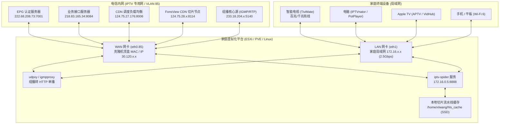

# 架构设计与底层原理

本文档详细阐述上海电信（中兴/华为平台）IPTV 系统的认证交互、组播直播分发与 HLS 回看（时移）的底层运作机制，以及本项目作为聚合代理服务的核心架构设计。

---

## 1. 总体架构拓扑

---

## 2. 核心工作原理

### 2.1 EPG 认证与登录握手（Auth Pipeline）
1. **握手与挑战**: 机顶盒通过 `eth0.85` 向电信认证服务器（`222.68.208.73:7001`）发起请求，上报硬件 MAC、机顶盒序列号（SN）、型号（如中兴 B860AV2.1-T）。
2. **CTC 令牌加密**: 电信认证系统返回动态加密串，机顶盒内部通过 CTC JS 脚本（本项目内嵌 `modules/jsvm` 引擎）执行计算，返回有效的 `bims_user_token`、`JSESSIONID` 以及 `AuthInfo` 身份票据。
3. **有效期与续期**: 认证凭证通常具备几小时至数天的有效期，`iptv-spider` 会在后台定时自动检测并刷新。

### 2.2 频道列表与 EPG 节目录制抓取
- **全量频道**: 服务端通过 `action=getChannelList` 获取上海电信提供的全部频道（包括央视、各大卫视、上海本地台、高清以及 4K 频道）。
- **EPG 节目单**: 通过 `action=getChannelProg` 定期抓取过去 7 天及未来 3 天的节目单数据，入库持久化（支持 SQLite / MySQL），并生成标准的 XMLTV 格式文件（`/api/epg.xml`）。
- **M3U 订阅生成**: 生成标准 M3U 播放列表（`/api/m3u8`），注入频道 tvg-id、tvg-logo、分组及回看捕获标记 `catchup="append"`。

### 2.3 组播直播（Multicast Live）
- **机制**: 直播流采用 UDP/RTP 组播分发（如 `rtp://233.18.204.188:5140`）。
- **局域网分发**: 家庭网关或虚拟机运行 `udpxy`，将局域网内的 HTTP 请求（如 `http://172.16.0.5:5140/rtp/233.18.204.188:5140`）转换为 IGMP 加入组播组，千兆局域网内任意客户端均可秒开观看，不消耗外网下行带宽。

### 2.4 TVOD 回看与时移（Catchup HLS）
- **RTSP 淘汰与转向 HLS**:
  - 上海电信早期曾支持 RTSP 协议（554 端口）时移，但目前新架构 CDN 已经对外部 RTSP 握手直接回复 TCP RST 拒绝连接。
  - 现行全面采用 **HTTP Live Streaming (HLS)** 切片点播架构。
- **动态切片解析**:
  - 客户端请求回看某时段节目时，`iptv-spider` 自动在数据库匹配出对应的 `playbillID`，调用电信接口 `action=getTvodPlayUrl`。
  - 获取到形如 `http://124.75.27.176:8006/SHDXFH_live/.../index.m3u8?AuthInfo=...&Playseek=...` 的回看地址。
  - 代理服务向电信拉取该 M3U8 播放列表，将其中的 CDN 分片地址重写为本地代理格式 `http://<LAN_IP>:8888/api/proxy/segment.ts?url=<ENCODED_CDN_URL>`。
- **流水线预读缓存引擎（Pipeline Preload Engine）**:
  - 针对电信 CDN 的流控特性（单长连接持续下载会降速至 240KB/s，但每个新建连接带 `Range: bytes=0-` 可获得 100Mbps 突发速度），代理服务在后台建立超前 2 个分片的异步下载流水线，保证终端播放器获取切片始终命中本地极速缓存（延迟 < 20ms）。
