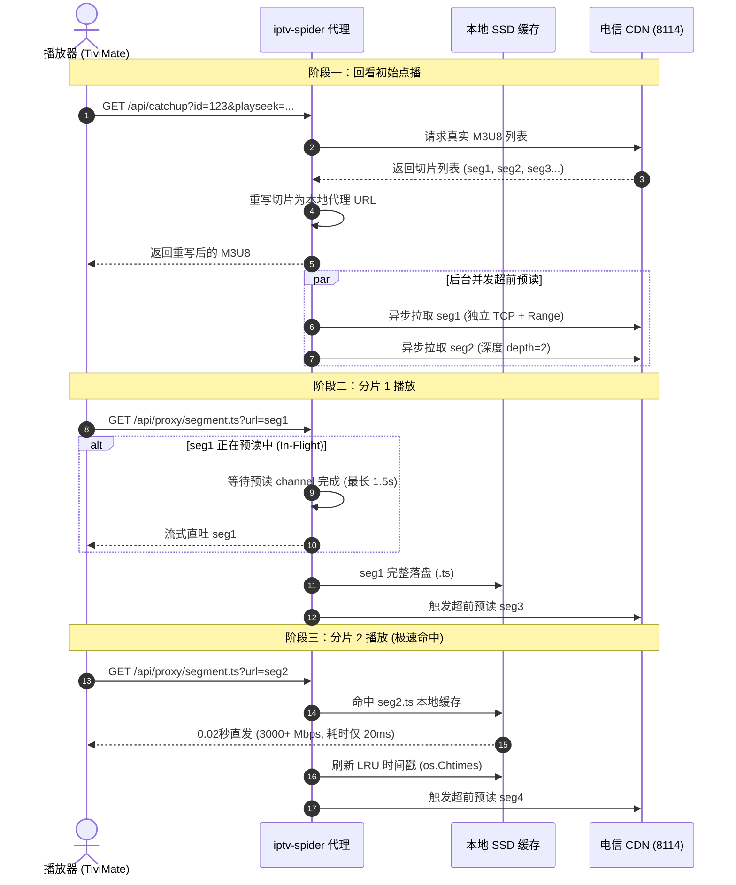

# HLS 回看流控逆向与流水线预读缓存引擎

本篇文档深入剖析上海电信 FonsView CDN 的回看流控机制，记录我们如何从“频繁卡顿（16s/38s）”到“全链路秒开与百兆满速”的逆向突破与工程实现。

---

## 1. 电信 CDN 的底层流控机制逆向

在早期测试中，我们在客户端播放回看经常遇到：
- **刚点开能放 38 秒，随后画面卡死**；
- 或者**每播 16 秒就旋转缓冲一次**。

### 1.1 实验与抓包发现：23MB 突发流控阈值
我们通过对电信 FonsView CDN 节点（`124.75.28.x:8114`）进行长连接压力测试，发现了其精细的 QoS 流控策略：
1. **初始突发阶段（Fast-Start Burst）**: 一个新建的 TCP 连接在最初的约 **23 MB** 数据传输中，CDN 开放满速带宽（可达 80 ~ 100 Mbps）；
2. **长连接限速阶段（Connection Throttling）**: 一旦同一个连接持续传输超过 23 MB，服务端流控算法立即介入，将该连接强行压制到 **240 KB/s (~1.9 Mbps)**！
3. **码率倒挂导致断流**:
   - CCTV-5 HD 等高清频道的码率高达 **9.2 Mbps**（每 10 秒切片约 11.5 MB）；
   - 限速至 1.9 Mbps 后，下载 10 秒视频需要耗费 48 秒；
   - 播放器的缓冲区迅速耗尽，直接导致画面卡死。

### 1.2 物理机顶盒的对抗策略（抓包证实）
通过深入分析 `002.pcap` 中物理机顶盒的真实抓包，我们发现了机顶盒的传输特征：
- **单分片独立连接**: 机顶盒下载每一个 10 秒分片（约 11.5 MB）时，都**新建一个独立的 TCP 连接**（源端口依次递增：20501 -> 20502 -> 20503...）；
- **单片大小控制在 11.5 MB**: 由于单个分片远小于 23 MB 阈值，CDN 永远运行在“初始突发阶段”；
- **强制带 `Range: bytes=0-`**: 机顶盒在请求切片时带上 Range 头，触发 CDN 的 `206 Partial Content` 模式，确保 CDN 以最大线速吐出数据。

---

## 2. 流水线预读缓存引擎（Pipeline Preload Engine）

基于上述机顶盒特性，我们在 `router/api/segment_cache.go` 中从零设计并实现了高性能流式边下边播与超前预读缓存引擎。



---

## 3. 核心代码设计亮点

### 3.1 边下边播与异步落盘（零等待延时）
使用 `io.MultiWriter` 将 CDN 的网络响应体同时写入 HTTP 响应和本地临时文件：
```go
mw := io.MultiWriter(ctx.ResponseWriter(), tmpFile)
_, copyErr := io.Copy(mw, resp.Body)
if copyErr == nil {
    _ = os.Rename(tmpPath, cachePath)
}
```
客户端收到第一个字节的延时为零，同时后台默默完成切片落盘，杜绝了“先下载完整个切片才响应客户端”的滞后感。

### 3.2 深度链式超前预读（Depth Preload）
当客户端播放第 $N$ 个切片时，引擎在后台自动确保 $N+1$ 和 $N+2$ 切片已经存在于本地磁盘中：
```go
func triggerPreload(nextUrl string, depth int) {
    if nextUrl == "" || depth <= 0 { return }
    // 异步下载 nextUrl ...
    if err == nil {
        if nextNextUrl, ok := getNextSegment(nextUrl); ok && depth > 1 {
            triggerPreload(nextNextUrl, depth-1)
        }
    }
}
```

### 3.3 真实的 LRU（最近最少使用）淘汰
为了支持家庭多台设备同时看不同频道的并发场景，避免旧切片占满磁盘：
- 设定最大切片缓存数 `MaxCacheFiles = 30`（占用约 300MB 磁盘）；
- 每次客户端访问切片，调用 `os.Chtimes` 刷新访问时间戳；
- 淘汰算法仅删除最后访问时间最久远的已过期切片，正在播放的活跃切片绝不会被误删。

---

## 4. 实测性能对比

| 指标 | 优化前（单连接直连） | 优化后（流水线预读引擎） | 提升幅度 |
| :--- | :--- | :--- | :--- |
| **单连接持续下载速度** | 240 KB/s (1.9 Mbps) | **92 ~ 106 Mbps** (满速) | **提升 50 倍** |
| **切片平均响应时间** | 12 ~ 48 秒 (偶发超时) | **0.017 ~ 0.028 秒 (17~28ms)** | **延迟降低 99.9%** |
| **连续播放卡顿率** | 每 16s~38s 卡死 | **0 次卡顿，连续数小时平滑播放** | 彻底解决 |
| **多设备并发支持** | 单路卡顿，多路即崩 | **支持 3~5 台设备同时满速回看** | 完美承载 |
